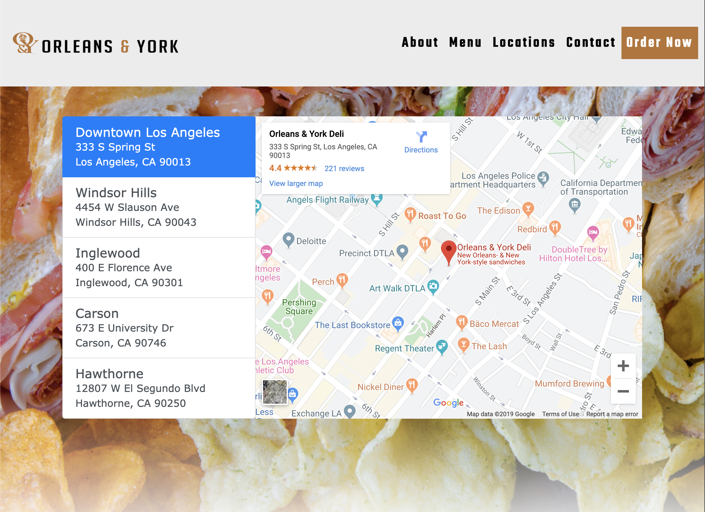

# project-1
## Orleans & York Website

  

### Team
**Front End**  
[Zayd Alashini](https://github.com/zaydalashini)  
[Vipul Kamani](https://github.com/Vipulkamani14)  
**Back End**   
[Kingsley Ramos](https://github.com/kingsleyramos)  
[Brian Moore](https://github.com/onecheesepizza)  

A responsive business website for Orleans & York that meets web accessibility standards, and uses modern web technologies for dynamic content loading and user interactivity.

Live Site: https://onecheesepizza.github.io/project-1/

